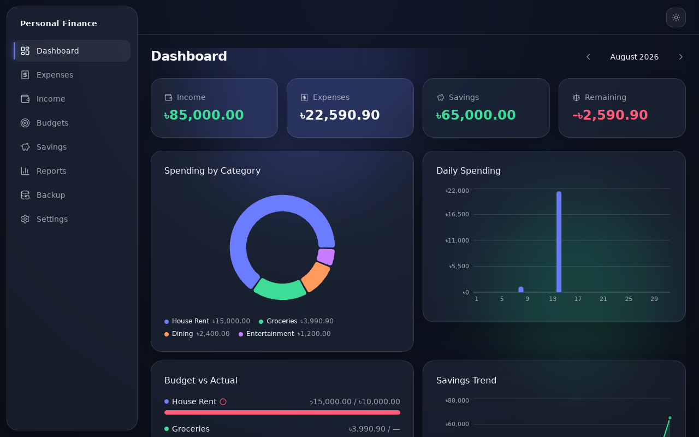

# AR Money Manager (Desktop)

A free, offline, privacy-first **personal finance** app and **money management software** for Windows — a true **money management desktop app** for tracking income, expenses, budgets, and savings goals in a local SQLite database. No account, no cloud, no telemetry, ever.



## Why this app exists

Answer six questions, fast, without sending your financial data anywhere:

1. How much money did I earn this month?
2. Where did my money go?
3. How much have I saved?
4. How much money is remaining?
5. Am I overspending?
6. Can I stay within my monthly budget?

## Features

- **Quick Add Expense** (`Ctrl+E`) — a near-instant capture flow, designed to take about 10 seconds.
- **Income, expenses, and fixed/recurring expenses** with search, filtering, and CSV export.
- **Budgets** — overall and per-category monthly budgets with live budget-vs-actual and overspending warnings.
- **Dashboard** — an animated glass-effect view of income, expenses, savings, spending by category, daily spending, and budget status.
- **Savings & goals** — general savings, DPS, emergency fund, and custom goals with progress tracking.
- **Reports** — a monthly summary that always matches the dashboard, plus structured CSV export.
- **Backup & restore** — one-click manual backups, automatic safety copies before every restore and schema migration, and a stale-backup reminder.
- **Keyboard-first** — a `Ctrl+K` command palette, a full shortcut set, and every flow completable without a mouse.
- **Dark, light, or system theme.**

## Privacy

This app is local-only by design:

- Your data lives in a single SQLite file on your own machine — there is no account, no server, and no sync.
- No network calls anywhere in the app. No telemetry, analytics, or crash reporting, ever.
- Backups, exports, and imports only ever touch paths you explicitly pick via a native file dialog.

## Download

Windows installers are published on the [Releases page](https://github.com/walidhasan89/AR-Money-Manager/releases/latest). Installers are unsigned for now (self-published, MVP release) — Windows SmartScreen may warn on first run; this is expected and documented, not a sign of tampering.

## Tech stack

| Layer | Choice |
|---|---|
| Shell | Tauri 2 (Rust) |
| UI | React 18 + TypeScript (strict) |
| Styling | Tailwind CSS |
| Charts | Recharts |
| Animation | Framer Motion |
| Database | SQLite (via `tauri-plugin-sql`) |
| State | Zustand |
| Forms/validation | React Hook Form + Zod |

See `docs/architecture/ARCHITECTURE.md` for the full rationale.

## Building from source

Requirements: Node.js 20+, Rust (stable, via `rustup`), and the [Tauri prerequisites](https://tauri.app/start/prerequisites/) for your OS.

```bash
npm install
npm run tauri dev    # run in development
npm run tauri build  # produce a release build/installer for your platform
```

Frontend-only checks:

```bash
npm run lint
npm run format:check
npm run test
```

Rust checks (from `src-tauri/`):

```bash
cargo fmt --check
cargo clippy --all-targets -- -D warnings
cargo test
```

## Where to start reading

| If you want to... | Read |
|---|---|
| Understand the product | `docs/product/PRD.md` |
| See what shipped, in what order | `ROADMAP.md` and `docs/phases/` |
| Understand the database | `docs/database/SCHEMA.md` |
| Understand the visual design language | `docs/ui-ux/DESIGN_SYSTEM.md` |
| Contribute | `CONTRIBUTING.md` |

## Project status

✅ **v1.0.0 — MVP complete** (Phases 1–8): daily-driveable, offline, private, with the full intended feature set and visual polish.

## License

[MIT](LICENSE)
